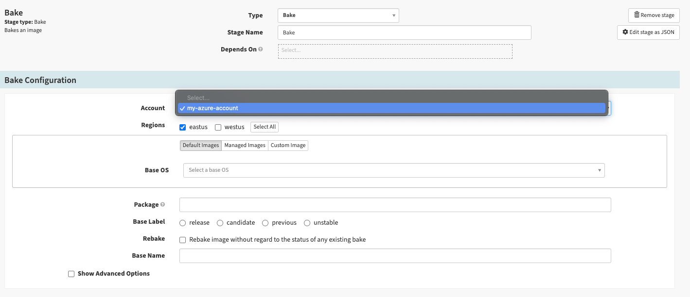

Please make a pull request to describe any changes you wish to highlight
in the next release of Spinnaker. These notes will be prepended to the release
changelog.

## Coming Soon in Release 1.30

### Spring Boot 2.4

Spinnaker 1.30 uses Spring Boot 2.4, where 1.29 uses Spring Boot 2.3.  Spring
Boot 2.4 considers session data cached by Spring Boot 2.3 invalid.  Therefore,
users with cached sessions will be unable to log in until the invalid
information is removed from the cache.  Open browser windows to Spinnaker are
unresponsive after the deployment until they’re reloaded.  Executing:

    $ redis-cli keys "spring:session*" | xargs redis-cli del

on Gate's redis instance removes the cached session information.

### doNotEval SpEL helper

The `doNotEval` SpEL helper makes it possible to skip SpEL evaluation in other SpEL helpers e.g. `toJson`.

For example, if the evaluation context is defined only `fileMap` object:

```java
Map<String, Object> fileMap = Collections.singletonMap("owner", "managed-by-${team}");
```

An exception will be thrown in attempt to get JSON because of `fileMap` contains SpEL inside.

```shell
${#toJson(fileMap)}
```

In the given case `fileMap` contains SpEL for another tool e.g. Terraform. Use `doNotEval` to let Spinnaker know
that this SpEL should be evaluated by a different tool. No exceptions are thrown this way.

```shell
${#toJson(#doNotEval(fileMap))}
```

Use a feature flag to enable.

```yaml
# orca-local.yml

expression:
  do-not-eval-spel:
    enabled: true
```
### Artifact handling

#### Changes to the way artifact constraints on triggers work

If you have a pipeline with multiple triggers using different artifact constraints/expected artifacts, these have for a while been evaluated in an unexpected matter.


In this example, even though each trigger has its own artifact(s) defined, when one of the artifacts is present, all of the defined artifact constraints on all triggers are evaluated. If _any_ of them are missing, the pipeline will not trigger. This is [fixed](https://github.com/spinnaker/orca/pull/4322) in Spinnaker 1.30 to only consider the artifacts that are defined on the triggered trigger (there's [an exeption](https://github.com/spinnaker/orca/pull/4397/files#diff-b25c50ecaceee2f8b0ae1ddc77fc92d48d16fb7ff9d15d27612685f1985b2a1eR241-R243) for artifacts that have defined a default artifact or use prior execution; they will always be considered). If you've relied on this bug, you'll need to add manually add all the artifact constraints to all triggers to replicate the previous behavior.

#### Binding inline artifacts

When defining an inline artifact, e.g. a deploy manifest, Spinnaker will now resolve it in the same way as it does with artifacts that are defined on triggers. Before you could only use SPeL to resolve version numbers etc. ([#4397](https://github.com/spinnaker/orca/pull/4397/files#diff-b25c50ecaceee2f8b0ae1ddc77fc92d48d16fb7ff9d15d27612685f1985b2a1eR146-R147))


### Azure image baking improvements

#### Deck

- Select an Azure account and bake per account.
  
- You can bake an image using a Managed Image from your Azure account as a base image in the Bake stage.
  
- You can bake an image using a Custom Image as a base by specifying the `Publisher`, `Offer`, and `SKU`.
  

#### Clouddriver

- Replace deprecated Azure SDK `com.microsoft.azure:azure` with the new Azure SDK `com.azure.resourcemanager:azure-resourcemanager`
- Add a new `AzureManagedImageCachingAgent` which is caching managed images from the specified region and resource group
- Update `AzureVMImageLookupController` to return the newly cached managed images when `managedImages` query parameter is set to `true`

#### Rosco

[Upgraded CentOS base image](https://github.com/spinnaker/rosco/pull/916) to version `7.5`.

### Addition of includeEvents parameter
`includeEvents` has been [added as a configurable parameter in orca](https://github.com/spinnaker/orca/pull/4301) that enables users to fetch [Kubernetes Events](https://kubernetes.io/docs/reference/kubernetes-api/cluster-resources/event-v1/) from clouddriver. This parameter defaults to `false` and is supported by `DeployManifestStage`, `ScaleManifestStage`, `DisableManifestStage`, `EnableManifestStage`, `PatchManifestStage`, `ResumeRolloutManifestStage` and `UndoRolloutManifestStage` stages.

Once the parameter has been configured and the value is set to true then orca retrieves the events back from clouddriver. Be aware that the size of the pipeline execution context may (significantly) increase by including events.

### Kubectl output

With https://github.com/spinnaker/clouddriver/pull/5846 and https://github.com/spinnaker/orca/pull/4374, it's now possible to include kubectl output in the pipeline execution context, by setting `kubernetes.jobExecutor.persistTaskOutput` to true and then setting `kubernetes.jobExecutor.enableTaskOutputForAllAccounts` to true to include it for all accounts, or setting the debug property to true for individual accounts.

### Kubernetes

Users coming to Spinnaker are now more familiar with Blue/Green industry terminology than the Netflix specific phrasing Red/Black

- The Red/Black rollout strategy is marked as deprecated in the UI. Change done [here](https://github.com/spinnaker/deck/pull/9911)
- A Blue/Green rollout strategy is added that is functionally equivalent to the Red/Black rollout strategy. Changes done in [clouddriver](https://github.com/spinnaker/clouddriver/pull/5811) and [orca](https://github.com/spinnaker/orca/pull/4332)
- Introduce a pipeline validator in Front50 that validates if red/black is used when creating/updating a Kubernetes pipeline.  For now, it is logging a warning, but it will fail when we remove the red/black Kubernetes traffic management strategy. Change done [here](https://github.com/spinnaker/front50/pull/1176)

### Gate

https://github.com/spinnaker/gate/pull/1610 expands support for adding request headers to the response header.  Previously limited to `X-SPINNAKER-REQUEST-ID`, it's now possible to specify any fields with a `X-SPINNAKER` prefix via the new `interceptors.responseHeader.fields` configuration property.  The default value is `X-SPINNAKER-REQUEST-ID` to preserve the previous functionality.

```yaml
#gate.yml

interceptors:
  responseHeader:
    fields:
      - X-SPINNAKER-REQUEST-ID
      - X-SPINNAKER-USER
```

### dynamicRollbackTimeout

To make the dynamic timeout available, you need to enable the feature flag in Orca and Deck.

**Orca**

https://github.com/spinnaker/orca/pull/4383 overrides the default value rollback timeout - 5min - with a UI input from the user.

``` yaml
#orca.yml

rollback:
  timeout:
    enabled: true
```

**Deck**

https://github.com/spinnaker/deck/pull/9937 enhances the Rollback Cluster stage UI with timeout input.

`window.spinnakerSettings.feature.dynamicRollbackTimeout = true;`

The default is be used if there is no value set in the UI.

### send job name as query parameter to Igor

#### Orca
- The feature flag introduced in Orca (1.29 release) to use the new Igor `stop` endpoint will be enabled by default when Orca starts
    ```
    feature:
      igor:
        jobNameAsQueryParameter: true
    ```
    See the changes [here](https://github.com/spinnaker/orca/pull/4412)
- Pending any issues uncovered this release the flag will be removed and behavior defaulted in an upcoming release
